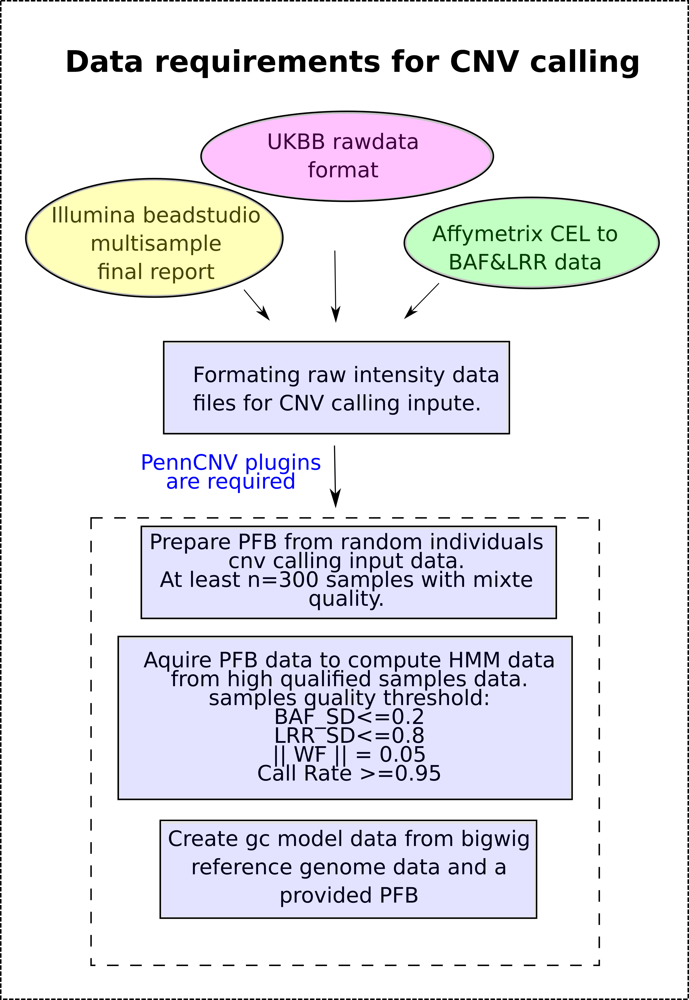
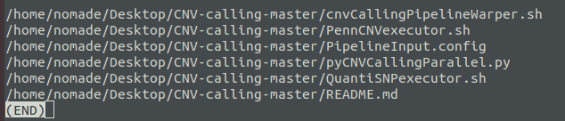
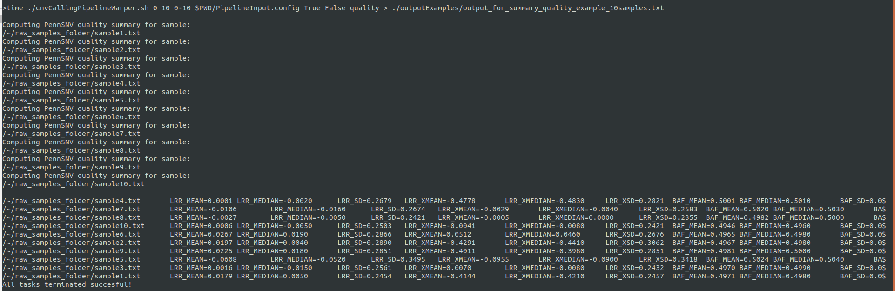
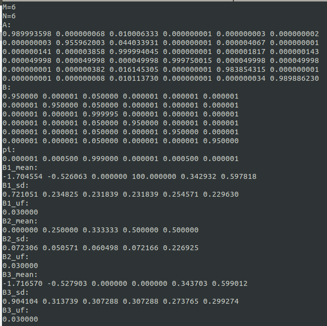
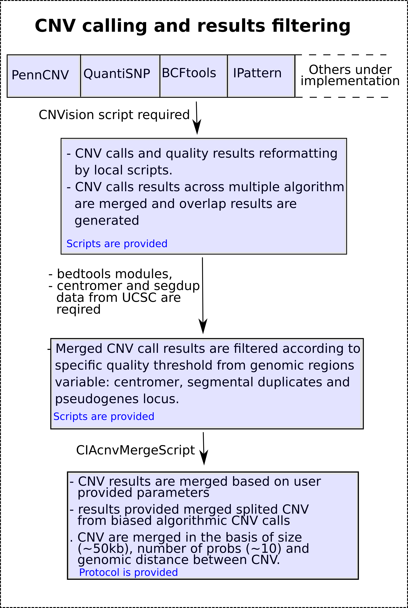
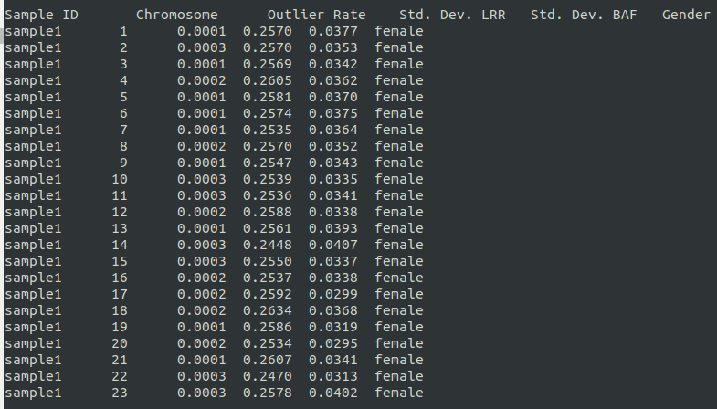
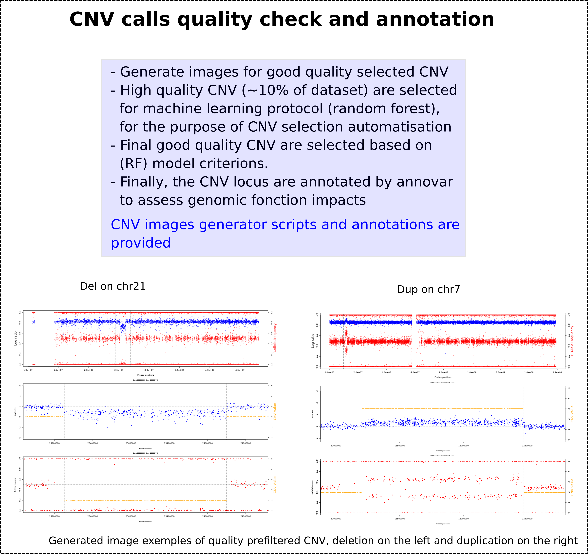

# Data input preparation

This section is specialy made for research lab that whant to prepare their CNV calling input files from the UKBB cohort. For those that are familiar with the UKBB (Uk biobank) cohort snp array genotyping data, it's easy to quickly realize that the data are presented in a high dimensional level and very high storage memory. The manipulation of these data is very challenging and for lab groups that do not have computational ressources, this challenge difficulty might be increased.

Our goal in this section is to create a tool which will help researchers to better parse the UK biobank data at a low cost of computational ressources and efficient execution time. The scripts are located in repository called "UKBB_DATA_GENERATOR". The image below shows a summary view of the data preparation protocol. To better understand the protocol, it's recommended to study the scripts and any constructive suggestion will be wellcome and greatful.

<p align="center">
  
</p>
Before executing the analysis, here is an overview of the working repository.

```text
# Below is the user specified B Allele frequency score data location

/~/BAFrawData

/~/BAFrawData/UKB_genotype_baf

/~/BAFrawData/UKB_genotype_baf/ukb_baf_chr1_v2.txt
...
/~/BAFrawData/UKB_genotype_baf/ukb_baf_chrY_v2.txt

/~/BAFrawData/UKB_genotype_baf/completeMergeBAF_chr1
...
/~/BAFrawData/UKB_genotype_baf/completeMergeBAF_chrY

/~/BAFrawData/UKB_genotype_baf/fragmentedBAF_chr1
...
/~/BAFrawData/UKB_genotype_baf/fragmentedBAF_chrY

# Below is the user specified Log R Ration score data location

/~/LRRrawData

/~/LRRrawData/UKB_genotype_l2r

/~/LRRrawData/UKB_genotype_l2r/ukb_l2r_chr1_v2.txt
...
/~/LRRrawData/UKB_genotype_l2r/ukb_l2r_chrY_v2.txt

/~/LRRrawData/UKB_genotype_l2r/completeMergeLRR_chr1
...
/~/LRRrawData/UKB_genotype_l2r/completeMergeLRR_chrY

/~/LRRrawData/UKB_genotype_l2r/fragmentedLRR_chr1
...
/~/LRRrawData/UKB_genotype_l2r/fragmentedLRR_chrY

# Below is the user specifile confidence score data location

/~/CRrawData

/~/CRrawData/UKB_genotype_con

/~/CRrawData/GCSCORErawData/ukb_con_chr1_v2.txt
...
/~/CRrawData/GCSCORErawData/ukb_con_chrY_v2.txt

/~/CRrawData/GCSCORErawData/completeMergeCR_chr1
...
/~/CRrawData/GCSCORErawData/completeMergeCR_chrY

/~/CRrawData/GCSCORErawData/fragmentedCR_chr1
...
/~/CRrawData/GCSCORErawData/fragmentedCR_chrY

# This is the user specified fam file data location

/~/UKBB_fam_file/ukbb.fam

# This is the user specified SNP data location

/~/SNPrawData/ukbbSNP_chr1.bim
...
/~/SNPrawData/ukbbSNP_chrY.bim

# If the user specified the same root directory as
# final report output, then the results repositories
# will look like below:

/~/OutputFinalReport_00
...
/~/OutputFinalReport_09
```

The scripts that help to format and generate the final reports should be located at:
```text
/~/CNV-calling/UKBB_DATA_GENERATOR/formatUKBBdataToFinalReport.py
/~/CNV-calling/UKBB_DATA_GENERATOR/generateFinalReportFromTransposeData.py
/~/CNV-calling/UKBB_DATA_GENERATOR/warperForfileTranspose.sh
/~/CNV-calling/UKBB_DATA_GENERATOR/warperForFinalreportOutput.sh
```
Before starting to extract reduced final report input for CNV calling from the UKBB big matrixes, on need to reformat the raw downloaded data. As indicated in the summary image above, UKBB provide the BAF, LRR, ConfidenceScore in big high dimensional matrixes. We also need to take in count that the sample and the SNP line up in the files remain the same in all of the other files.

1. To start formating the raw data, the user should run the command line below, it can be run sequencialy or in parallel. Three task is available in this plugin and the user is able to provide them in parametter. 
Lets run an example of the three available task in parallele:
```bash
bash ./warperForfileTranspose.sh 3 1 5 . BAF:LRR:CR
```
Thee above option will run 3 parallel tasks, each on a different processor. This is why the per task reserve RAM memory should be available on the computing machine, otherwise, the execution will raise and Out Of Memory error.
here is a definition of the above used parametter in the same order they were used:
```text
arg1: number of tasks
arg2: chromosome to analyse
arg3: required RAM memory to reserve for the process
arg4: root path to the raw data
arg5: the task option to execute
```
In the other hand, if one want to execute the process sequencialy for any reason, here is a useful command line:
```bash
for option in BAF LRR CR
        do
        	bash ./warperForfileTranspose.sh 1 1 5 . "$option"
        done;
```
In the above case, the user is computing sequencial jobs, therefore only one CPU is required while the amount of required memory remain unchanged.

Now that the big transposed matrix is created, on can extract reduced final report for CNV calling from them. To do so, the user can use the provided script named "warperForFinalreportOutput.sh". The script is entirely parallelizable, and the command line bellow should do the jobs.
```bash
transposedData=/base_path_to_the_transposed_matrix/...
FRdirectory=/path_to_the_reduced_Final_report_output_results/...
bash ./warperForFinalreportOutput.sh 10 all $transposedData $FRdirectory
```
The above directory will execute 10 parallel tasks, each task is the extraction and writing of a different reduced final report data. The user must not forget that this process require at least 10 CPU cores to be available on the machine.
There is no need to worry about RAM memory usage, since the process does not buffer the whole transposed data in the available computer RAM. it only buffer ~12Mb x 2 of RAM, which represent one line per matrix, and therefore the required data to output a single reduced final report file. Once the the file is stored on the disk (wd), the RAM is cleared and ready for a next extraction. In conclusion, our example will use 10 cores of CPU and 240 Mb of RAM (10 cores x 12Mb x 2 lines).

In some cases, on might acquired illumina beadstudio final report which contained data for all individuals. Since the CNV caller require that the reduced final report to be splitted individualy, the user can use the provided per script by PennCNV called "split_illumina_report.pl", located at "~/PennCNV-1.0.5/" and work as below.

```bash
Usage:
     split_illumina_report.pl [arguments] <reportfile>

     Optional arguments:
            -v, --verbose                   use verbose output
            -h, --help                      print help message
            -m, --man                       print complete documentation
            -p, --prefix <string>           prefix of output file name
            -s, --suffix <string>           suffix of output file name
            -n, --numeric_name              use numeric file name (default: Sample ID is file name)
            -c, --comma                     fields are comma-delimited (default: fields are tab-delimited)
            -t, --tolerate                  tolerate records without LRR/BAF information
            -r, --revised_file <file>       path to "revised" file of alternate sample IDs
                --tolerate
``` 
One must be aware that header collumns order will not necessairly be respected from a lab data to another, and that's the reason that we must always verify the collumn order. Lucky you !!!, we developped a data splitting procedure which take in count more parametters and take care of the BAF, LLR and the order variables in the matrix. The goal is not to make the process more complicated but istead to make the process more specific.
Some procedures require additional analysis on the genotyped markers. This mean, if a subset of SNP hasn't been well genotyped accorss the cohort, they got to be removed from the raw data, therefore this option is available from our script. The process cannot be parallelized since the algorithm need to read the file up until the end. The process execution time in linear O(n), but improuvement will be applied by using file index jumper technic.

The scripts are available in the path "~/CNV-calling/Illumina_beadStudio_data_splitter/SplittedIlluminaBeadStudioFinalReport.py" and can be executed as below. But before executing the scripts, the user must prepare a list of high quality SNPs (see the format below) and a list of sample ID which need to be extracted (see format below).

Example of SNP list file and it doesn't contain any header:

Example SNP_list.txt
```text
rs4477212	1	82154
rs3094315	1	752566
rs3131972	1	752721
rs12562034	1	768448
rs12124819	1	776546
rs11240777	1	798959
rs6681049	1	800007
```
Example sample_list.txt
```text
sampleID1
sampleID2
...
sampleIDn
```
Command line to execute the script, also python3 is required:

```bash
python3 SplittedIlluminaBeadStudioFinalReport.py ./path_to_beadstudion_FinalReport/BigIllumina_FinalReport.txt ./path_to_list_of_ID_to_be_extracted/sample_list.txt ./path_to_output_data_directory/Output_splitted_data ./path_to_snpList_file/SNP_list.txt
```

# CNV-calling

This pipeline is a warper tools which will help users to easily call CNV uppon array genotyping data like illumina OMNI2.5, Infinium, or Affimetrix Axiom, genome wide 6.0, etc... . The goal of this tool also consist on helping users to call CNV in a high performance way, where all functions in the pipeline are optimized to use the least amount of memory (RAM) possible, to avoid generating the least possible temporary data and optimize the available storage space. Other than the scripts optimization, the pipeline is built to paralellize the jobs: meaning each individual CNV calls are computing separatly in a single CPU core. To do so, openMP and mpi4py compiled with gcc base are required. The pipeline creates automaticaly all required folders, and both CNV calling algorithms (PennCNV and QuantiSNP) results are stored seperatly. The only human manual preprocesses that are required by the pipeline are:

1) Make sure gcc based (glibc 2.6 or higher) for openMP is installed, it's usually already preinstalled on the linux OS (ubuntu or CentOS)

   Link to linux rpm and deb downloads:

   https://pkgs.org/

2) Ensure that python 3.X is available on the machine and the mpy4py module is installed. Since many other statistical modules might be required by the CNV calling tools, it is recommended to install anaconda. 

   Link to anaconda:

   https://www.anaconda.com/distribution/

   from anaconda bin directory istall: getuser and mpy4py modules. mpi4py should be gcc based version and not INTEL. instead of using pip or python -m pip for module installation, it's recommended to use conda for the module installation, because conda will install not only the requested module but also all required dependencies and libraries to help the module work as expected.

```bash
   Install mpi4py module &&
   cd /path_to_anaconda_install_dir/bin/
```
Then hit,
```
   conda install -c conda-forge/label/gcc7 mpi4py
```
   then follow the onscreen instructions. The above module is important for the task of parallelisation.


3) Download and install PennCNV and QuantiSNP from the link below:

   http://penncnv.openbioinformatics.org/en/latest/
   
   https://github.com/WGLab/PennCNV
   
   https://sites.google.com/site/quantisnp/home

   After compiling and installing pennCNV according to the tool readme, it's important to compile the kext libraries located on the PennCNV installation folder. Those libraries are usefull for self HMM training.

   Most researchers are already aware that genotyping quality may varies between individuals from the same cohort but also between genotyping technologies. Therefore, training HMM data integrity may differ from one genotyping technology to another, and could have negative consequences on CNV calling results. To fix this problem, it's always better to build specific HMM for specific cohort. 

4) Finaly, fill out the configuration file (.config file) with all required paths for the tools and files paths.


# Running the pipeline scripts


<p align="center">
  
</p>
1) First, one need to make sure that all individuals signal files are well formated according to the below example. Name them as following: 

```bash 
SAMPLE_NAME_1.txt
SAMPLE_NAME_2.txt
.
.
.
SAMPLE_NAME_n.txt
```

Input signal file example:

Name | Chr | Position | Samplename.Log R Ratio | SampleName.B Allele Freq
---- | --- | -------- | ---------------------- | ------------------------
rs116720794 | 1 | 729632 | -0.083 | 1
rs3131972|1|752721|-0.202|0.533
rs12184325|1|754105|-0.152|1
rs3131962|1|756604|-0.286|0.535
rs114525117|1|759036|-0.097|1
rs3115850|1|761147|0.003|0.459
rs115991721|1|767096|0.013|0
rs12562034|1|768448|0.275|1
rs116390263|1|772927|0.352|0.997

For the remaining input file format, please refer to the PennCNV official readme web site.

2) Download the pipeline scripts and save them in the master project repository using the git commandline:
   
   ```bash
   git clone https://github.com/labjacquemont/CNV-calling.git
   ```
   
   then, 
   
   ```bash
   unzip CNV-calling-master && cd CNV-calling-master
   ```

The user project repository should look as below.


<p align="center">
  
</p>
Before running the pipeline, one need to compute the pfb file required by PennCNV.
To do so, the user should shuffle a list of at leat 300 samples from the project cohort and 
compute the population B allele frequency using the provided PennCNV plugins.

# Generate PFB per SNP data

PFB data is reqired for CNV calling by pennCNV. To compute pfb for a CNV calling project by PennCNV, it exists 2 possibility based on the sample size available. A sample size of the project cohort less than ~300 samples means that there is not enough observation to compute statisticaly significant population frequency. Therefore the user must download a generic version of the pfb data that reflect the cohort ancestry. In this case, the user can follow the bellow procedure.

The script belong to PennCNV groups autorship name (Leandro Lima lelimaufc@gmail.com) and is available at the PennCNV-seq github repository:
```bash
cd PennCNV-Seq
mkdir /path_to_the_pfb_dataset_downloaded_directory/downloadedGenericPFB
Execute the bash script download_and_format_database.sh by following the help instructions, for example:
./download_and_format_database.sh hg19 1 0
Means that the user chose to download hg19 version of the pfb dataset, (1) choose to split the dataset by chromosome, (0) doesn't want do download the fasta files
```
The download will need to be saved in /path_to_the_pfb_dataset_downloaded_directory/downloadedGenericPFB folder then locate the files with the following pattern "hg38_ALL.sites.2015_08.txt". Since the UCSC dataset doesn't necessairely provide similar SNP name as the commercial ones (Affimetrix, Illumina, etc), it's important that the user match their project SNP names to the downloaded one. 
Here is an example of the download file:
```text
Chr	Position	Ref	Alt	PFB	Name
Y	1085877	G	A	0.000399361	.
Y	1086306	A	C	0.00599042	.
Y	1086318	G	A	0.000399361	.
Y	1086324	T	G	0.000599042	.
Y	1086388	T	G	0.000998403	.
Y	1086395	C	T	0.000199681	.
Y	1086416	G	A	0.000599042	.
Y	1086422	A	G	0.0201677	.
Y	1086430	G	A	0.0229633	.
Y	1086494	G	A	0.0890575	.
```
Here is the expected PFB format:
```text
Name    Chr     Position        PFB
rs116720794     1       729632  0.9712014314928431
rs3131972       1       752721  0.8398232323232327
rs12184325      1       754105  0.9630711422845696
rs3131962       1       756604  0.8488260000000004
rs114525117     1       759036  0.9528859275053313
rs3115850       1       761147  0.8336490280777547
rs115991721     1       767096  0.012686746987951802
rs12562034      1       768448  0.8934478957915828
rs116390263     1       772927  0.9518046092184369
rs4040617       1       779322  0.14156425702811246
```

The user must intersect the project SNP locus data to the downloaded PFB data in other to produce the expect PFB data as formatted above. To do so, one might need the betools intersectbed available at https://github.com/arq5x/bedtools or through apt-get

If the user cohort size is graiter than 300 samples, then the user can compute the PFB dataset on his own cohort intensity files. To do so, the user have 2 options computing linearly the analysis without worry about additional files manipulation. The user need to create a list of the raw samples, each preceding their path. The user must not forget to select the best qualified samples (See the CNV calling requirement preparation). Prior the this analysis, the user must compute the summary quality analysis for all the samples then extract the best qualified samples based specific quality threshold criterion (BAF_SD: B Allele frequency standard deviation), LRR_SD: Log R Ratio standard deviation, ||WF||: Absolute value of the wave factor, The sample array call rate(Example are provided graph). 

The user can use the compute_pfb.pl plugins locate in the installation directory of PennCNV, follow the command line below to compute the PFB:

command line to compute pfb

The above procedure require high memory usage since the matrix of individuals by marker will be loaded in the computer RAM memory, followed by subsequent normalisation analysis. This methode is not recommended for good productivity analysis. The alternative way is to compute the PFB data is more efficient than above. The user must fragment the best qualified sample data into chromosomes and remake a list per chromosome for the PFB analysis. Here we provide some scripts which will allow the user
to compute pfb analysis task per chromosomes 

# Generate GC correct per SNP data

GC correct technic is important in CNV calling since it helps the researchers to evaluate the genomic site wave length factor in the cohort genotyping data.

To create GC content data for a project, if is not available for the SNP array technology, one can refer to the well explained tutorial by Vib Bioinformatics Core available at https://wiki.bits.vib.be/index.php/Create_a_GC_content_track#cite_note-2 . 

# Generate samples quality summary data for inspection
The samples quality inspection is required for the HMM training step. As we recommend users to compute their
cohort specific HMM uppon their best qualified samples. Once the quality summary data is generated for
each sample, the best samples must be selected according the following parametters:

* BAF_SD: B Allele Frequency standard deviation
* LRR_SD: Log R Ration  standard deviation
* WF: Wave Factor
* Call Rate: Samples Array Genotyping Call Rate

To compute the summary quality data of the cohort, the user must provide to the pipeline the list of all individuals and follow the instruction in the readme.md file. Also, this step of the pipeline can be exectuted in parallel tasks.

Here is an example of the command line on 10 subjects:

```bash
bash ./cnvCallingPipelineWarper.sh 0 10 0-10 $PWD/PipelineInput.config True False quality > ./outputExamples/output_for_summary_quality_example_10samples.txt
```
The execution last only 15 seconds for the analysis of 10 samples. The output results should looks like the printscreen below:

<p align="center">
  
</p>

The output results files are located in the provided directory (config file):

```bash
ls /Path_to_the_pipeline_installation_repository/AnalysisScripts_CNVcalling/CNVpennCNV/BATCH_00/LOG_DATA
autosome_sample1.log 
autosome_sample2.log
 ...
autosome_sample10.log
```
Using linux classic oneliner command lines, one can filter out bad quality samples and keep the best ones 
with at most an LLR_SD value of 0.20 or lower. Why .20 or lower? because PennCNV HMM training default QC only accept
samples quality that passing the indicated threshold.

# Generate cohort specific HMM data

Now that we have the best quality samples, one can compute the HMM trainning using the option "hmm". Before launching the analysis, make sure that the list of the best quality samples is already created and specified in the config file. Also one must indicate the location to save the hmm file. This process can not be executed in parallel and can last between 1-2hr for a sample size of ~400 individuals. To start the analysis, follow the command line below:

```bash
./cnvCallingPipelineWarper.sh 0 10 0-10 $PWD/PipelineInput.config True False hmm
```bash

The hmm process example using 10 samples last ~10mn, it saves the results in the ressources directory as below:
```bash
/ressources/myPersonalProjectHMM.hmm
/ressources/myPersonalProjectHMM.lrr_baf_pfb
```
The HMM file should looks like the printscreen below.

<p align="center">
  
</p>

The HMM results is a pre-requisite file for PennCNV only, QuantiSNP is able to create it's own EM model each time the CNV calling algorithm is launch. To build a better understand on how and why PennCNV use an HMM model please refer to their tools published paper and repository (http://penncnv.openbioinformatics.org). 

# CNV detection


<p align="center">
  
</p>

The PennCNV running dependencies are now satisfied. We can run the CNV detection by PennCNV or QuantiSNP, or by both together. In this example, we will call the CNVs by each algorithm separatly. This process is entirely parallelizable with high efficiency. In order to activate the PennCNV CNV calling option, the user must provide the CNV detection option as "detect" and as allways, set the PennCNV option to "True". Here is the command line example to call the CNV with PennCNV in parallele.

```bash
./cnvCallingPipelineWarper.sh 0 10 0-10 $PWD/PipelineInput.config True False detect
```

The results for 10 samples in parallele are generated in 45 seconds and use less than 1Mb of RAM memory. The PennCNV CNV detection results are saved in the below folder:

```bash
ls  /Path_to_the_pipeline_installation_repository/AnalysisScripts_CNVcalling/CNVpennCNV/BATCH_00/CNV_DATA
autosome_sample1.rawcnv
gonosome_sample1.rawcnv
autosome_sample2.rawcnv
gonosome_sample2.rawcnv
...
autosome_sample10.rawcnv
gonosome_sample10.rawcnv
```
Here is a printscreen example of PennCNV output results for sample1

<p align="center">
  
</p>

Now, we will show the example of CNV calling by the QuantiSNP algorithm. It's the same command line but the PennCNV algorithm execution boolean will be set to False while the QuantiSNP one will be set to True alone. In this case, remember that the only valide CNV detection option is "detect", the two others are useless. The CNV calling by QuantiSNP is also entirely parallelizable. Here is the command line example for the QuantiSNP execution.

```bash
 ./cnvCallingPipelineWarper.sh 0 10 0-10 $PWD/PipelineInput.config False True detect
```
The analysis take ~4.5mn and use ~2Mb of RAM. The results are located in the following directory:
```bash
ls /Path_to_the_pipeline_installation_repository/AnalysisScripts_CNVcalling/CNVquantiSNP/BATCH_00/sample1.outdir
sample1.cnv
sample1.loh
sample1.qc
```

The QuantiSNP samples quality analysis generates quality assessment results per chromosome, since the users require often the quality results for the whole individuals array, then we provide a script which is able to averaged and standardize the quality values.
```bash
/script localisation/ to do
```
Here is the original printscreen for the QuantiSNP quality output. As we see the format is different from PennCNV one, therefore the standardisation of both data formats is required. 

<p align="center">
  
</p>

Here is a printscreen example of the QuantiSNP CNV detection results output.
<p align="center">
  
</p>

# CNV quality check and annotation for functional inquireries

<p align="center">
  
</p>


# Reference

    Wang K, Li M, Hadley D, Liu R, Glessner J, Grant S, Hakonarson H, Bucan M. PennCNV: an integrated hidden Markov model designed for high-resolution copy number variation detection in whole-genome SNP genotyping data Genome Research 17:1665-1674, 2007
    Diskin SJ, Li M, Hou C, Yang S, Glessner J, Hakonarson H, Bucan M, Maris JM, Wang K. Adjustment of genomic waves in signal intensities from whole-genome SNP genotyping platforms Nucleic Acids Research 36:e126, 2008
    Wang K, Chen Z, Tadesse MG, Glessner J, Grant SFA, Hakonarson H, Bucan M, Li M. Modeling genetic inheritance of copy number variations Nucleic Acids Research 36:e138, 2008
