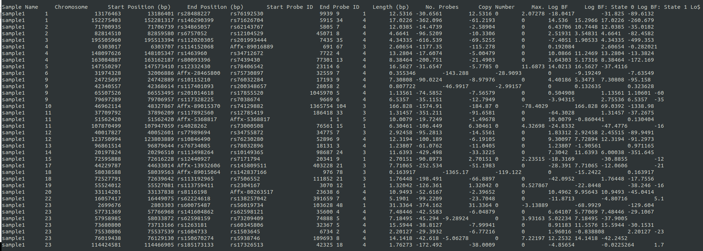

# CNV-calling
This pipeline is a warper tools which consist on helpping users to easily call CNV uppon array genotyping data, for example: illumina OMNI2.5, Infinium, or Affimetrix Axiom, genome wide 6.0 etc. The goal of this tool also consisted on helping users to call CNV in a high performance way, were all functions in the pipeline were optimized to use the least amount of computational (RAM) possible, to avoid generated the least possible temporary data, therefore, optimize the available storage space. Other than the scripts optimization, the pipeline is built to paralellize the jobs, meaning each individuals CNV calls is computing separatly in a single CPU core. To do so, openMP and mpi4py compiled with gcc base are required. The pipeline creates automaticaly all require folders, and both CNV calling algorithm results are store seperatly. The only human manual preprocesses that are require by the pipeline are:

1) Make sure gcc based (glibc 2.6 or higher) for openMP is installed, it's usually already preinstalled on the linux OS (ubuntu or CentOS)

   Link to linux rpm and deb downloads:

   https://pkgs.org/

2) Insure that python 3.X is available on the machine and the mpy4py module is installed, since many other statistical module might be required by the CNV calling tools, it might be recommended to install anaconda. 

   Link to anaconda:

   https://www.anaconda.com/distribution/

   from anaconda bin directory istall: getuser and mpy4py module, mpi4py should be gcc based version and not INTEL. instead of using pip or python -m pip for module installation, it's recommended to use conda for the module installation, because conda will install not only the requested module but also all required dependencies and libraries to help the module work as expected.

   Install mpi4py module

   cd /path_to_anaconda_install_dir/bin/ , then hit
   conda install -c conda-forge/label/gcc7 mpi4py

   then follow the onscreen instruction. The above module is important for the task parallelisation.

3) Download and install PennCNV and QuantiSNP from the link below:

   http://penncnv.openbioinformatics.org/en/latest/
   
   https://github.com/WGLab/PennCNV
   
   https://sites.google.com/site/quantisnp/home

   After compiling and install pennCNV according to the tool readme, it's important to compile the kext libraries located on the    PennCNV installation folder. These libraries are usefull for self HMM training.

   Most researchers are already aware that genotyping quality may varies between individuals from the same cohort but also between genotyping technologies. Therefore, training HMM data integrity may difer from one genotyping technology to another, and could have negative consequence on CNV calling results. To fix this problem, it's alway better to built specific HMM for fpecific cohort. 

4) Finaly, fill out the configuration file (.config file) with all required path and file path.

# Running the pipeline scripts

1) First, one need to make sure that all individuals signal files are well formated according to the bellow example, the name them as following: *SAMPLE_NAME_1.Signal.txt, SAMPLE_NAME_2.Signal.txt, ... ,SAMPLE_NAME_n.Signal.txt*

Input signal file example:

Name | Chr | Position | Samplename.Log R Ratio | SampleName.B Allele Freq
---- | --- | -------- | ---------------------- | ------------------------
rs116720794 | 1 | 729632 | -0.083 | 1
rs3131972|1|752721|-0.202|0.533
rs12184325|1|754105|-0.152|1
rs3131962|1|756604|-0.286|0.535
rs114525117|1|759036|-0.097|1
rs3115850|1|761147|0.003|0.459
rs115991721|1|767096|0.013|0
rs12562034|1|768448|0.275|1
rs116390263|1|772927|0.352|0.997

For the remaining input file format, please refer to the PennCNV official readme web site.

2) Download the pipeline scripts and save them in the master project repository using the git commandline:
   
   > git clone https://github.com/labjacquemont/CNV-calling.git
   
   then, 
   > unzip CNV-calling-master && cd CNV-calling-master
   
The user project repository should look as below.

Before running the pipeline, one need to assure to compute the pfb file required by PennCNV.
To do so, the user should shuffle a list of at leat 300 samples from the project cohort and 
compute the population B allele frequency using the provided PennCNV plugins.

# Generate PFB per SNP data

# Generate GC correct per SNP data

# Generate samples quality summary data for inspection
The samples quality inspection is require for the HMM training step. As we recommend users to compute their
cohort specific HMM uppon their cohort best qualified samples, once the quality summary data is generated for
each sample, the bast samples must be selected according the following parametters:

BAF_SD: B Allele Frequency standard deviation

LRR_SD: Log R Ration  standard deviation

WF: Wave Factor

Call Rate: Samples Array Genotyping Call Rate

To compute the summary quality data of the cohort, the user must provide to the pipeline the list of all individuals
, and follow the pipeline how to in the readme.md file. Also, this step of the pipeline can be exectuted in parallel
tasks.

Here is an example of the command line on 10 subjects:

> bash ./cnvCallingPipelineWarper.sh 0 10 0-10 $PWD/PipelineInput.config True False quality > ./outputExamples/output_for_summary_quality_example_10samples.txt

The execution last only 15 seconds for the analysis of 10 samples. The output results should looks like the printscreen below:

The output results files are located in the provided directory (config file):
> ls /Path_to_the_pipeline_installation_repository/AnalysisScripts_CNVcalling/CNVpennCNV/BATCH_00/LOG_DATA

> autosome_sample1.log 

> autosome_sample2.log

> ...

> autosome_sample10.log

Using linux classic oneliner command lines, one can filter out bad quality samples and keep the best ones 
with at most an LLR_SD value of 0.20 or lower. Why .20 or lower? because PennCNV HMM training default QC only accept
samples quality that passing the indicated threshold.

# Generate cohort specific HMM data

Now that we have the best quality samples, one can compute the HMM trainning using the option "hmm". Before launching the analysis, make sure that the list of the best quality samples is already created and specified in the config file. Also on must indicate the location to save the hmm file. This process can not be executed in parallel and can last between 1-2hr for a sample size of ~400 individuals. To start the analysis, follow the command line below:

> ./cnvCallingPipelineWarper.sh 0 10 0-10 $PWD/PipelineInput.config True False hmm

The hmm process example using 10 samples last ~10mn, it saves the results in the ressources directory as below:
> /ressources/myPersonalProjectHMM.hmm

> /ressources/myPersonalProjectHMM.lrr_baf_pfb

The HMM file should looks like the printscreen below.

# CNV detection

The PennCNV running dependencies is now satisfied, now one can run the CNV detection by PennCNV or QuantiSNP, or by both together. This example we will call the CNV by each algorithm separatly. This process is entirely parallelizable with high efficiency. In other to activate the PennCNV CNV calling option, the user must provide the CNV detection option as "detect" and as allways, set the PennCNV option to "True". Here is the command line example to call the CNV with PennCNV in parallele.

> ./cnvCallingPipelineWarper.sh 0 10 0-10 $PWD/PipelineInput.config True False detect

The results for 10 samples in parallele are generated in 45 seconds and use less than 1Mb of RAM memory. The PennCNV CNV detection results are save in the below folder:

> /Path_to_the_pipeline_installation_repository/AnalysisScripts_CNVcalling/CNVpennCNV/BATCH_00/CNV_DATA

> autosome_sample1.rawcnv

> gonosome_sample1.rawcnv

> autosome_sample2.rawcnv

> gonosome_sample2.rawcnv

> ...

> autosome_sample10.rawcnv

> gonosome_sample10.rawcnv

Here is a printscreen example of PennCNV output results for sample1

Now, we will show the example of CNV calling by the QuantiSNP algorithm, it's the same command line but the PennCNV algorithm execution boolean will be set to False while the QuantiSNP one will be set to True alone. In this case, remember that the only valide CNV detection option is "detect", the two others are useless. The CNV calling by QuantiSNP, same as the PennCNV, is entirely parallelizable. Here is the command line example for the QuantiSNP execution.

> ./cnvCallingPipelineWarper.sh 0 10 0-10 $PWD/PipelineInput.config False True detect

The analysis take ~4.5mn and use ~2Mb of RAM. The results are located in the following directory:

> ls /Path_to_the_pipeline_installation_repository/AnalysisScripts_CNVcalling/CNVquantiSNP/BATCH_00/sample1.outdir

> sample1.cnv

> sample1.loh

> sample1.qc

The QuantiSNP samples quality analysis generates quality assessment results per chromosome, since the users require often the quality results fot the whole individuals array, then we provide a script which is able to averaged and standardize the quality values.

> /script localisation/ to do

Here is the original printscreen for the QuantiSNP quality output. As we see the format is different than PennCNV, therefore the standardisation of both data format is required. 

Here is a printscreen example of the QuantiSNP CNV detection results output.

